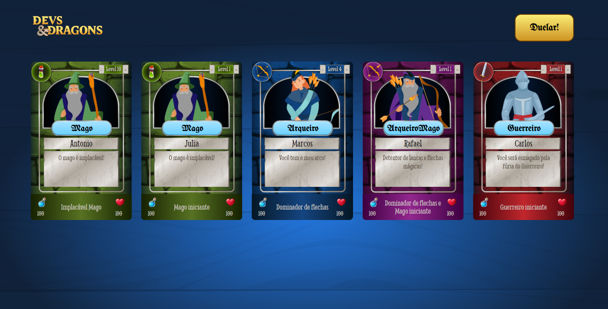

Devs & Dragons

Projeto "Devs & Dragons" desenvolvido durante o curso "JavaScript: classes e heranças no desenvolvimento de aplicações com orientação a objetos".

## Screenshots

## Ferramentas utilizadas

- HTML
- CSS
- JavaScript

## Funcionalidades
- Sistema de batalha entre cartas, podendo resultar em vitória, derrota ou empate;
- Botões de adicionar níveis à carta (de 1 a 10), influenciando diretamente no confronto. 

## Feito por:

Lucas Kenji (dinozindev).
